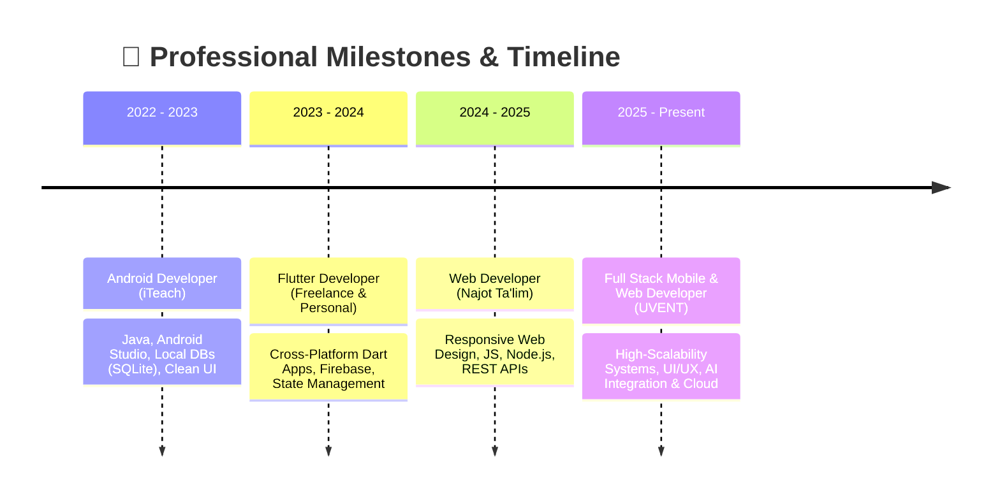

<p align="center">
  
</p>

<h3 align="center">
  <samp>
    &gt; Hey There!, I am
    <b><a target="_blank" href="https://github.com/inomjon0770">Inomjon Ikromjonov</a></b> (Mr.Inomjon)
  </samp>
</h3>

<p align="center">
  <samp>
    「 Android, Flutter & Full Stack Web Developer from <b>Uzbekistan</b> 🇺🇿 」
  </samp>
</p>

<p align="center">
  <a href="https://github.com/inomjon0770">
    
  </a>
</p>

<p align="center">
  
</p>

<p align="center">
  <a href="https://t.me/inomjon_201o" target="_blank">
    
  </a>
  &nbsp;
  <a href="mailto:ikromjonovinomjon87@gmail.com">
    
  </a>
  &nbsp;
  <a href="https://www.buymeacoffee.com/inomjon2010" target="_blank">
    
  </a>
  &nbsp;
  
  &nbsp;
  
</p>

---

### 👨‍💻 About Me

```yaml
Developer Profile:
  Name: Inomjon Ikromjonov (Mr.Inomjon)
  Specialization: Android, Flutter & Full Stack Web Development
  Experience: 3+ Years Building Production Apps & Modern Systems
  Education: Najot Ta'lim (Web) | iTeach (Android) | UVENT (Flutter)
  Languages: English (C1 Advanced), Russian (Intermediate), Korean (Elementary), Uzbek (Native)
  Motto: "Consistency > Motivation | Build → Learn → Improve"
```

- 📱 **Mobile Development**: High-performance native **Android** (**Java**, **Kotlin**) & cross-platform apps using **Flutter / Dart** and **React Native**.
- 🌐 **Modern Web Engineering**: Responsive, SEO-optimized web apps utilizing **HTML5, CSS3, JavaScript, Node.js & RESTful APIs**.
- ☁️ **Cloud & Databases**: Proficient in **Firebase** (Auth, Firestore, Cloud Functions, FCM, Realtime DB), **SQLite / Room**, and backend architectures.
- 🎓 **Continuous Growth**: Studied at **Najot Ta'lim** (Web Development), **iTeach** (Android Development), and **UVENT** (Flutter Development).

---

### 🔧 What I Build

- 📱 **Cross-Platform Mobile Apps**: Clean architecture Flutter applications with state management (BLoC / Provider / Riverpod).
- 🤖 **Native Android Systems**: Robust Java/Kotlin mobile apps with Room database, multimedia streaming, and background workers.
- 🌐 **Full-Stack Web Applications**: Scalable RESTful API backends with Node.js/Express and fast responsive frontends.
- 🔔 **Cloud & Realtime Services**: Firebase-powered real-time synchronization, push notification systems (FCM), and authentication.
- 💳 **Commercial Integration**: Payment gateway integrations, digital subscription systems, and e-commerce platforms.

---

### 🧠 Interests & Focus Areas

- 📱 **Mobile Engineering**: Native Android & Cross-Platform Flutter development with top-tier UI/UX.
- 🤖 **Artificial Intelligence & Backend**: Exploring LLM integrations, AI agents, and microservice architectures.
- 💡 **Startup & Product Building**: Creating production-ready applications, MVPs, and passive income digital products.
- 🎯 **Global Aspirations**: Becoming a Senior Mobile/Full-Stack Engineer & pursuing graduate studies in the USA.

---

### ⚡ Engineering Philosophy

- 🚀 **Consistency > Motivation**: Daily disciplined coding delivers exponential long-term mastery.
- 🧩 **Simple Code > Complex Code**: Write maintainable, self-documenting code that scales effortlessly.
- 🛠️ **Build → Learn → Improve**: Real-world deployed apps teach more than passive tutorials.
- ✨ **User Experience Matters**: Speed, accessibility, and intuitive design drive product success.

---

### 🛠 Technologies & Tools

<table align="center" border="0" cellspacing="0" cellpadding="8">
  <tr>
    <td align="center" title="Flutter"><br/><sub><b>Flutter</b></sub></td>
    <td align="center" title="Dart"><br/><sub><b>Dart</b></sub></td>
    <td align="center" title="Kotlin"><br/><sub><b>Kotlin</b></sub></td>
    <td align="center" title="Java"><br/><sub><b>Java</b></sub></td>
    <td align="center" title="Android"><br/><sub><b>Android</b></sub></td>
    <td align="center" title="React Native"><br/><sub><b>React</b></sub></td>
  </tr>
  <tr>
    <td align="center" title="JavaScript"><br/><sub><b>JavaScript</b></sub></td>
    <td align="center" title="Node.js"><br/><sub><b>Node.js</b></sub></td>
    <td align="center" title="Express"><br/><sub><b>Express</b></sub></td>
    <td align="center" title="HTML5"><br/><sub><b>HTML5</b></sub></td>
    <td align="center" title="CSS3"><br/><sub><b>CSS3</b></sub></td>
    <td align="center" title="Python"><br/><sub><b>Python</b></sub></td>
  </tr>
  <tr>
    <td align="center" title="Firebase"><br/><sub><b>Firebase</b></sub></td>
    <td align="center" title="SQLite"><br/><sub><b>SQLite</b></sub></td>
    <td align="center" title="PostgreSQL"><br/><sub><b>PostgreSQL</b></sub></td>
    <td align="center" title="MySQL"><br/><sub><b>MySQL</b></sub></td>
    <td align="center" title="Postman"><br/><sub><b>Postman</b></sub></td>
    <td align="center" title="Linux"><br/><sub><b>Linux</b></sub></td>
  </tr>
  <tr>
    <td align="center" title="Git"><br/><sub><b>Git</b></sub></td>
    <td align="center" title="GitHub"><br/><sub><b>GitHub</b></sub></td>
    <td align="center" title="VS Code"><br/><sub><b>VS Code</b></sub></td>
    <td align="center" title="Figma"><br/><sub><b>Figma</b></sub></td>
    <td align="center" title="Android Studio"><br/><sub><b>Android Studio</b></sub></td>
    <td align="center" title="REST API"><br/><sub><b>REST API</b></sub></td>
  </tr>
</table>

---

### 📊 Vital Statistics & Performance

<p align="center">
  
  &nbsp;
  
</p>

<p align="center">
  
</p>

---

### 🚀 Featured Projects

<table>
  <tr>
    <td width="50%" valign="top">
      <h3>📚 ReadUZ — Smart E-Reader Platform</h3>
      <p>A complete book-reading ecosystem with categorized digital libraries, instant search, bookmarking, favorites, and integrated subscription payments (15,000 UZS tier).</p>
      <p>
        
        
        
        
      </p>
      <ul>
        <li>⚡ Fast local caching & offline reading capabilities</li>
        <li>🔍 Real-time search with multi-filter categories</li>
        <li>💳 Automated subscription & premium reader unlocks</li>
      </ul>
    </td>
    <td width="50%" valign="top">
      <h3>🎬 Movie Stream UZ — Uzbek Streaming App</h3>
      <p>Modern mobile video streaming app tailored for Uzbek movies & TV series with adaptive streaming, watchlists, high-speed CDN delivery, and push notifications.</p>
      <p>
        
        
        
        
      </p>
      <ul>
        <li>🎥 High-quality adaptive video playback with subtitle support</li>
        <li>🔔 Instant FCM notifications for new episode premieres</li>
        <li>💾 Local caching with SQLite/Room for watchlist access</li>
      </ul>
    </td>
  </tr>
</table>

---

### 💼 Experience & Education Roadmap



---

### 🌐 Spoken Languages

| Language | Proficiency Level | Capability |
| :--- | :--- | :--- |
| 🇺🇿 **Uzbek** | Native | Mother Tongue (Native Speaker) |
| 🇬🇧 **English** | **C1 Advanced** | Professional & Academic Fluent Working Proficiency |
| 🇷🇺 **Russian** | Intermediate | Conversational & Technical Documentation |
| 🇰🇷 **Korean** | Elementary | Basic Everyday Phrases & Greetings |

---

### 🤝 Open for Opportunities & Collaboration

<table width="100%" border="0" cellspacing="10" cellpadding="0">
<tr>
<td width="50%" valign="top">

### 💡 What I'm Open To
- 📱 Native & Cross-Platform Mobile Apps (**Flutter / Android / Kotlin**)
- 🌐 Full-Stack Web Development & REST APIs (**Node.js / Express**)
- 🚀 Startup MVPs & High-Impact Commercial Solutions
- 🤖 AI-Enhanced Tools & Cloud Architectures

</td>
<td width="50%" valign="top">

### 📬 Direct Contact
- 💬 **Telegram**: [@inomjon_201o](https://t.me/inomjon_201o)
- 📧 **Email**: [ikromjonovinomjon87@gmail.com](mailto:ikromjonovinomjon87@gmail.com)
- 🐙 **GitHub**: [@inomjon0770](https://github.com/inomjon0770)
- ☕ **Support**: [buymeacoffee.com/inomjon2010](https://www.buymeacoffee.com/inomjon2010)

</td>
</tr>
</table>

---

<p align="center">
  <a href="https://t.me/inomjon_201o" target="_blank">
    
  </a>
  &nbsp;&nbsp;
  <a href="mailto:ikromjonovinomjon87@gmail.com">
    
  </a>
  &nbsp;&nbsp;
  <a href="https://www.buymeacoffee.com/inomjon2010" target="_blank">
    
  </a>
</p>

<p align="center">
  ⚡ Building scalable mobile & web apps, learning daily, and growing with consistency!
</p>

<p align="center">
  
</p>
