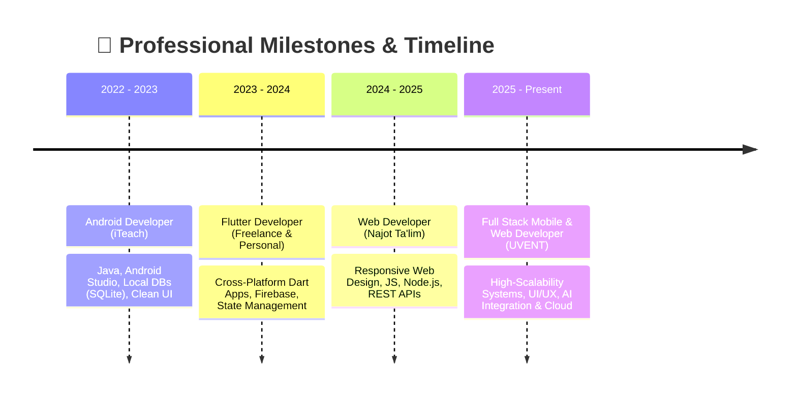

<p align="center">
  
</p>

<h3 align="center">
  <samp>
    &gt; Hey There! I'm <b>Inomjon Ikromjonov</b> (Mr.Inomjon)
  </samp>
</h3>

<p align="center">
  <samp>
    「 Android, Flutter & Full Stack Web Developer from Uzbekistan 🇺🇿 」
  </samp>
</p>

<p align="center">
  <a href="https://github.com/inomjon0770">
    
  </a>
</p>

<p align="center">
  <a href="https://t.me/inomjon_201o" target="_blank">
    
  </a>
  &nbsp;
  <a href="mailto:ikromjonovinomjon87@gmail.com">
    
  </a>
  &nbsp;
  <a href="https://www.buymeacoffee.com/inomjon2010" target="_blank">
    
  </a>
  &nbsp;
  
  &nbsp;
  
</p>

---

### 🚀 About Me

```yaml
Developer Profile:
  Name: Inomjon Ikromjonov (Mr.Inomjon)
  Specialization: Android, Flutter & Full Stack Web Development
  Experience: 3+ Years Building Production Apps & Modern Systems
  Education: Najot Ta'lim (Web) | iTeach (Android) | UVENT (Flutter)
  Languages: English (C1 Advanced), Russian, Korean, Uzbek (Native)
  Philosophy: "Consistency > Motivation | Build → Learn → Improve"
```

- 📱 **Mobile Development**: High-performance native **Android** (**Java**, **Kotlin**) & cross-platform apps using **Flutter / Dart** and **React Native**.
- 🌐 **Modern Web Engineering**: Responsive, SEO-optimized web apps utilizing **HTML5, CSS3, JavaScript, Node.js & RESTful APIs**.
- ☁️ **Cloud & Databases**: Proficient in **Firebase** (Auth, Firestore, Cloud Functions, FCM, Realtime DB), **SQLite / Room**, and backend architectures.
- 💡 **Passion & Mindset**: Focused on clean architecture, scalable codebases, UI/UX aesthetics, and rapid product development for startups and global markets.

---

### 🛠️ Tech Stack & Capabilities

#### 📱 Mobile App Development
<p align="left">
  
</p>

#### 🌐 Frontend & Web Development
<p align="left">
  
</p>

#### 🗄️ Backend, Databases & Cloud
<p align="left">
  
</p>

#### 🧰 Tools, Version Control & Design
<p align="left">
  
</p>

---

### 📊 GitHub Activity & Performance

<p align="center">
  
  &nbsp;
  
</p>

<p align="center">
  
</p>

---

### 🚀 Featured Projects

<table>
  <tr>
    <td width="50%" valign="top">
      <h3>📚 ReadUZ — Smart E-Reader Platform</h3>
      <p>A complete book-reading ecosystem with categorized digital libraries, instant search, bookmarking, favorites, and integrated subscription payments (15,000 UZS tier).</p>
      <p>
        
        
        
        
      </p>
      <ul>
        <li>⚡ Fast local caching & offline reading capabilities</li>
        <li>🔍 Real-time search with multi-filter categories</li>
        <li>💳 Automated subscription & premium reader unlocks</li>
      </ul>
    </td>
    <td width="50%" valign="top">
      <h3>🎬 Movie Stream UZ — Uzbek Streaming App</h3>
      <p>Modern mobile video streaming app tailored for Uzbek movies & TV series with adaptive streaming, watchlists, high-speed CDN delivery, and push notifications.</p>
      <p>
        
        
        
        
      </p>
      <ul>
        <li>🎥 High-quality adaptive video playback with subtitle support</li>
        <li>🔔 Instant FCM notifications for new episode premieres</li>
        <li>💾 Local caching with SQLite/Room for watchlist access</li>
      </ul>
    </td>
  </tr>
</table>

---

### 💼 Experience & Education Roadmap



---

### 🌐 Spoken Languages

| Language | Proficiency Level | Capability |
| :--- | :--- | :--- |
| 🇺🇿 **Uzbek** | Native | Mother Tongue (Native Speaker) |
| 🇬🇧 **English** | **C1 Advanced** | Professional & Academic Fluent Working Proficiency |
| 🇷🇺 **Russian** | Intermediate | Conversational & Technical Documentation |
| 🇰🇷 **Korean** | Elementary | Basic Everyday Phrases & Greetings |

---

### 🤝 Open for Opportunities & Collaboration

- 📱 Cross-platform & Native Mobile App Development (**Flutter / Android / Kotlin**)
- 🌐 Full Stack Web Development & API integrations (**Node.js / JavaScript**)
- 🚀 Startup MVP development & fast turnaround production apps
- 🤖 AI-enhanced tools & Cloud-backed solutions

---

### 📫 Contact & Support

<p align="center">
  <a href="https://t.me/inomjon_201o" target="_blank">
    
  </a>
  &nbsp;&nbsp;
  <a href="mailto:ikromjonovinomjon87@gmail.com">
    
  </a>
  &nbsp;&nbsp;
  <a href="https://github.com/inomjon0770">
    
  </a>
</p>

<p align="center">
  <a href="https://www.buymeacoffee.com/inomjon2010" target="_blank">
    
  </a>
</p>

<p align="center">
  
</p>
