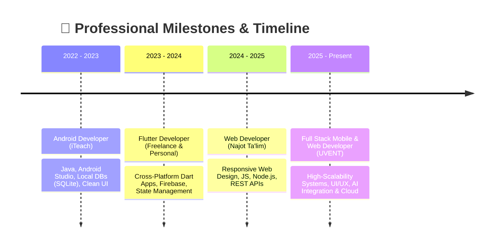

<div align="center">

  <!-- 🌟 Premium Animated Header -->
  

  <!-- ⚡ Animated Typing Banner -->
  <p align="center">
    <a href="https://github.com/inomjon0770">
      
    </a>
  </p>

  <!-- 🖼️ Cyberpunk Terminal Banner -->
  <p align="center">
    
  </p>

  <!-- 🏷️ Modern Info Cards -->
  <p align="center">
    
    
    
    
  </p>

  <!-- 📊 Live Profile Counters & Socials -->
  <p align="center">
    
    <a href="https://t.me/inomjon_201o" target="_blank">
      
    </a>
    <a href="mailto:ikromjonovinomjon87@gmail.com">
      
    </a>
    <a href="https://www.buymeacoffee.com/inomjon2010" target="_blank">
      
    </a>
  </p>

</div>

<!-- 🌈 Glowing Animated Separator -->
<div align="center">
  
</div>

## 👨‍💻 About Me

<div align="center">
  
  <br/>
  
</div>

<br/>


```kotlin
// 🚀 Developer Profile & Background
class InomjonIkromjonov {
    val name = "Inomjon Ikromjonov (Mr.Inomjon)"
    val role = "Android, Flutter & Full Stack Web Developer"
    val location = "Uzbekistan 🇺🇿"
    val spokenLanguages = listOf("Uzbek (Native)", "English (C1 Advanced)", "Russian", "Korean")
    val education = listOf("Najot Ta'lim (Web)", "iTeach (Android)", "UVENT (Flutter)")
    val coreStack = listOf("Flutter", "Kotlin", "Java", "Node.js", "Firebase", "SQL")
    
    fun getPhilosophy(): String = "Consistency > Motivation | Build → Learn → Improve"
    fun getMission(): String = "Crafting high-performance apps & preparing for USA graduate studies 🎯"
}

val dev = InomjonIkromjonov()
println(dev.getMission())
```

<br clear="right"/>

- 📱 **Mobile Development**: 3+ years crafting native **Android** (**Kotlin**, **Java**) & cross-platform (**Flutter**, **Dart**) apps with smooth 60fps animations.
- 🌐 **Modern Web Engineering**: Responsive, SEO-optimized web apps utilizing **Node.js, Express, JavaScript, HTML5 & CSS3**.
- ☁️ **Cloud & Databases**: Deep experience with **Firebase** (Auth, Firestore, Cloud Functions, FCM), **SQLite / Room**, and **PostgreSQL / MySQL**.
- 🧠 **Clean Architecture**: Strong focus on scalable architectures (MVVM, BLoC, Clean Code), microservices, and AI integrations.

<!-- 🌈 Glowing Animated Separator -->
<div align="center">
  
</div>

## 🛠️ Technology Stack & Toolbox

<div align="center">

### 🚀 Programming Languages


### 📱 Mobile & Web Frameworks


### 🗄️ Databases, Cloud & APIs


### 🧰 Tools & DevOps


</div>

<!-- 🌈 Glowing Animated Separator -->
<div align="center">
  
</div>

## 📊 GitHub Analytics & Activity

<div align="center">
  
  &nbsp;
  
</div>

<br/>

<div align="center">
  
</div>

<br/>

<div align="center">
  
</div>

<!-- 🌈 Glowing Animated Separator -->
<div align="center">
  
</div>

## 🚀 Featured Production Projects

<table>
  <tr>
    <td width="50%" valign="top">
      <h3>📚 ReadUZ — Smart E-Reader Platform</h3>
      <p>A full-featured book reading and discovery application with user authentication, category filtering, search, favorite lists, and premium subscription model.</p>
      <p>
        
        
        
        
      </p>
      <ul>
        <li>📑 Categorized digital library with instant search & cache</li>
        <li>💳 Automated subscription & payment integration (15,000 UZS)</li>
        <li>🌙 Custom e-reader reader mode with theme switcher</li>
      </ul>
    </td>
    <td width="50%" valign="top">
      <h3>🎬 Movie Stream UZ — Media Streaming</h3>
      <p>Modern mobile video streaming app tailored for Uzbek movies & TV series with adaptive streaming, watchlists, high-speed CDN delivery, and push notifications.</p>
      <p>
        
        
        
        
      </p>
      <ul>
        <li>⚡ Adaptive video player with low-latency buffering</li>
        <li>🔔 Firebase Cloud Messaging for episode releases</li>
        <li>💾 Offline metadata caching with local Room/SQLite database</li>
      </ul>
    </td>
  </tr>
</table>

<!-- 🌈 Glowing Animated Separator -->
<div align="center">
  
</div>

## 🎯 Learning Journey & Milestones

<div align="center">
  
</div>



<!-- 🌈 Glowing Animated Separator -->
<div align="center">
  
</div>

## 🌐 Spoken Languages

| Language | Proficiency Level | Capability |
| :--- | :--- | :--- |
| 🇺🇿 **Uzbek** | Native | Mother Tongue (Native Speaker) ⭐⭐⭐⭐⭐ |
| 🇬🇧 **English** | **C1 Advanced** | Professional & Academic Fluent Proficiency ⭐⭐⭐⭐☆ |
| 🇷🇺 **Russian** | Intermediate | Conversational & Technical Documentation ⭐⭐⭐☆☆ |
| 🇰🇷 **Korean** | Elementary | Basic Everyday Phrases & Greetings ⭐⭐☆☆☆ |

<!-- 🌈 Glowing Animated Separator -->
<div align="center">
  
</div>

## 💫 Daily Inspiration & Philosophy

<div align="center">
  
</div>

<br/>

```python
# 💭 Engineering Philosophy
philosophy = {
    "mindset": "Consistency > Motivation 🌱",
    "approach": "Learn by building real-world projects 🔨", 
    "code_quality": "Clean and maintainable > Overly complex ⚡",
    "motto": "Build → Learn → Improve 🚀"
}

print("Remember: Great software is built through daily focus and continuous improvement!")
```

<!-- 🌈 Glowing Animated Separator -->
<div align="center">
  
</div>

## 🤝 Let's Connect & Collaborate

<div align="center">
  
</div>

<br/>

<div align="center">
  <a href="https://t.me/inomjon_201o" target="_blank">
    
  </a>
  &nbsp;
  <a href="mailto:ikromjonovinomjon87@gmail.com">
    
  </a>
  &nbsp;
  <a href="https://github.com/inomjon0770">
    
  </a>
</div>

<br/>

<h3 align="center">☕ Support & Coffee:</h3>
<p align="center">
  <a href="https://www.buymeacoffee.com/inomjon2010" target="_blank">
    
  </a>
</p>

<!-- 🌈 Footer Animated Wave -->
<div align="center">
  
</div>

<div align="center">
  
</div>

<div align="center">
  <sub>✨ Crafted with ❤️ and lots of ☕ by <strong>Inomjon Ikromjonov</strong> | 2026 ✨</sub>
</div>
